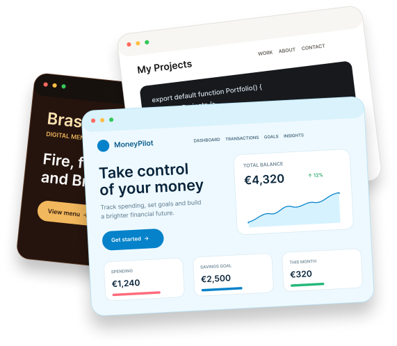

# Felipe Belphman — Front-End Portfolio

A multilingual and responsive front-end portfolio showcasing my projects, technical skills, development process and professional background.

Built with semantic HTML, modern CSS and vanilla JavaScript, with support for English, Brazilian Portuguese and Spanish.

## Features

- Responsive layout for desktop, tablet and mobile
- English, Brazilian Portuguese and Spanish translations
- Accessible navigation and interactive components
- Project case studies with dedicated pages
- Language preference saved locally
- Contact form and WhatsApp contact option
- FAQ accordion and animated interface elements
- Privacy Policy, Terms of Service and custom 404 page

## Featured Projects

### MoneyPilot

A personal finance platform designed to help users understand their finances, manage spending, create budgets and work toward financial goals.

### Black Bull Steak House

A responsive restaurant experience focused on clear navigation, visual presentation and mobile usability.

### Pet ID

A digital identification experience designed to help connect lost pets with their owners.

## Technologies

- HTML5
- CSS3
- JavaScript
- Responsive Web Design
- Semantic HTML
- Accessibility practices
- Git and GitHub
- Figma

## Internationalization

The portfolio includes a custom internationalization system built with JavaScript.

Supported languages:

- English (`en`)
- Brazilian Portuguese (`pt-BR`)
- Spanish (`es`)

The selected language is saved in local storage and reused across the portfolio pages.

## Project Structure

    portfolio-felipe-belphman/
    ├── assets/
    │   └── images/
    ├── index.html
    ├── projects.html
    ├── moneypilot.html
    ├── black-bull.html
    ├── black-bull-mobile.html
    ├── pet-id.html
    ├── privacy-policy.html
    ├── terms-of-service.html
    ├── 404.html
    ├── styles.css
    ├── script.js
    └── i18n.js

## Running Locally

No installation or build process is required.

1. Clone the repository.
2. Open the project folder.
3. Run `index.html` using a local development server, such as the Live Server extension for Visual Studio Code.

## Contact

- Email: [felipesbelphman@gmail.com](mailto:felipesbelphman@gmail.com)
- WhatsApp: [Send me a message](https://wa.me/353896028494)
- GitHub: [felipesbelphman-web](https://github.com/felipesbelphman-web)

## Author

Designed and developed by **Felipe S. Belphman**, Junior Front-End Developer based in Dublin, Ireland.
